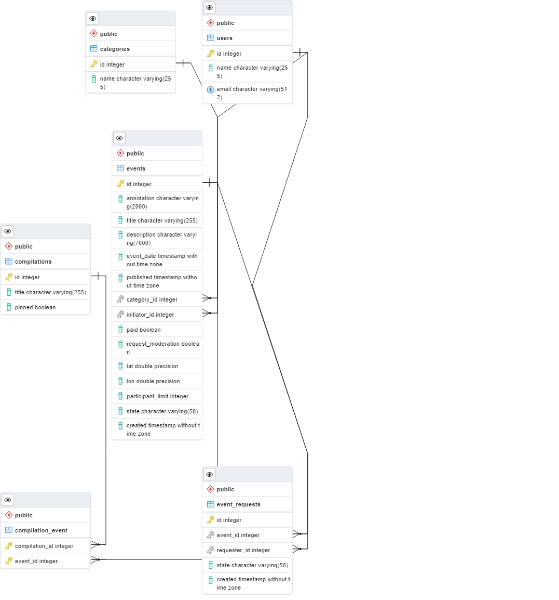

# java-explore-with-me

https://github.com/wikkicloud/java-explore-with-me/pull/1

Это приложение дает возможность делиться информацией об
интересных событиях и помогать найти компанию для участия в них.

Проект основан на микросервисной архетиктре, поэтому для его запуска 
понадобится Docker

Для запуска сервиса:
- необходимо создать пакеты jar `mvn clean package`
- в корне проекта выполнить команду
`docker compose up`

По-умолчанию сервис запуститься на порте 8080, но его можно изменить в файле
`docker-compose.yml`. 

Спецификации API:  
- [Спецификация основного сервиса](ewm-main-service-spec.json)
- [Спецификация сервиса статистики](ewm-stats-service-spec.json)

Для просмотра спецификации можно пользоватся сервисом  
[Swagger Editor](https://editor.swagger.io/)

ERD схема базы данных сервиса 

